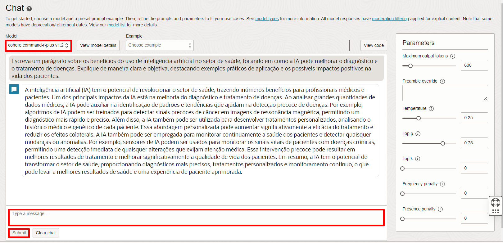
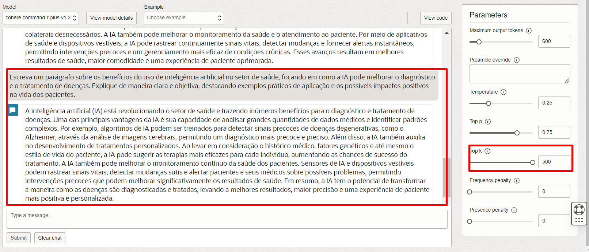
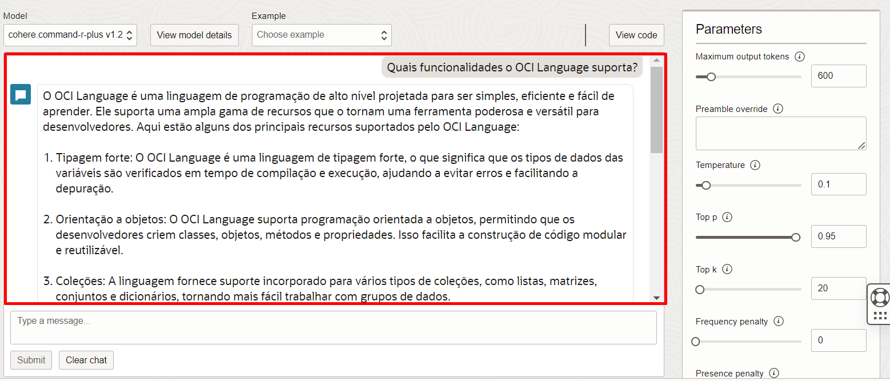

# Exploração do Playground do Serviço OCI Generativa AI

## Introdução

>A IA Generativa está transformando a forma como navegamos e utilizamos conhecimento, desde a síntese de dados complexos até a criação de respostas contextuais. Com a Oracle Cloud Infrastructure (OCI), incorporar funcionalidades de IA generativa nunca foi tão acessível.

 
### ⭕ **O que é Inteligência Artificial Generativa?**

A Inteligência Artificial Generativa é uma tecnologia de IA que cria novos conteúdos, como textos, imagens e vídeos, a partir de dados de treino. Em vez de apenas analisar dados, ela produz conteúdos originais, simulando criatividade humana.

| Capacidade         | Exemplos de Aplicações                           |
|--------------------|--------------------------------------------------|
| Criação de Conteúdo| Textos, imagens, vídeos, áudio                   |
| Assistência        | Atendimento ao cliente, assistentes virtuais     |
| Inovação           | Design de produtos, pesquisa e desenvolvimento   |
{: title=" "}

 
### ⭕ **Por que a Inteligência Artificial Generativa é importante?**

A IA Generativa automatiza tarefas criativas e cognitivas, o que pode:
- **Aumentar a produtividade**: Geração rápida de conteúdo personalizado.
- **Impulsionar a inovação**: Ferramentas para experimentação e desenvolvimento ágil.
- **Melhorar a experiência do cliente**: Respostas e interações mais naturais.
  
 
### ⭕ **O que é o Serviço de IA Generativa da OCI?**

O [**OCI Generative AI**](https://www.oracle.com/artificial-intelligence/generative-ai/large-language-models/) é um serviço gerenciado que oferece acesso a modelos de IA Generativa, como Llama 3.1 e Cohere Command R. Ele permite explorar e integrar IA generativa para diversos casos de uso, de forma escalável e segura.

Este serviço oferece uma maneira prática de incorporar IA Generativa, sem a necessidade de gerenciar infraestrutura complexa. O serviço possibilita experimentação rápida e integrações diretas para facilitar o desenvolvimento de soluções inteligentes e personalizadas. Modelos disponíveis:

| Modelo           | Descrição                                                                                             | Principais Características                            | Idiomas Suportados |
|------------------|-------------------------------------------------------------------------------------------------------|-------------------------------------------------------|---------------------|
| **Cohere Command R**   | Modelo otimizado para aplicações de **retrieval-augmented generation (RAG)**.                     | Alta eficiência, baixa latência, janela de contexto maior | 10 idiomas          |
| **Cohere Command R+**  | Versão aprimorada do Command R para **casos de uso especializados** como geração de conteúdo longo. | Gera respostas contextuais e detalhadas                | 10 idiomas          |
| **Cohere Embed**       | Modelos de embeddings para **converter texto em representações vetoriais**.                     | Versões “Light” são menores e mais rápidas            | Inglês e Multilíngue |
| **Meta Llama 3.1**     | Modelos open source de última geração com **alto desempenho e diversidade de respostas**.        | Janela de contexto de 128K e suporte para 8 idiomas   | 8 idiomas           |
{: title=" "}

### **Objetivos**

Neste workshop, você aprenderá a explorar os modelos de IA Generativa da OCI, baseados em grandes modelos de linguagem (LLMs). Embora seja possível integrar o serviço via APIs REST, permitindo que você incorpore essa tecnologia avançada em suas soluções de maneira prática e eficiente, neste laboratório usaremos o **playground** do serviço de IA Generativa na OCI. O playground oferece uma maneira prática e interativa de experimentar os recursos de IA generativa, sem a necessidade de configurações para integrar a funcionalidade a outros serviços.

O laboratório será dividido em três etapas, explorando diferentes aspectos de LLMs e IA Generativa:

1. **Embeddings**: Compreenda como os embeddings são usados para representar e buscar informações eficientemente.
2. **Geração de Texto**: Aprenda a gerar textos personalizados e contextuais para diversos casos de uso.
3. **Simulação de Fluxo de RAG (Retrieval-Augmented Generation)**: Veja como integrar a recuperação de informações com geração de texto para criar respostas contextuais a partir de dados específicos.

 
### **Recursos e Suporte**:

- **Documentação da Oracle Cloud**: [O que é Inteligência Artificial Generativa?](https://www.oracle.com/br/artificial-intelligence/generative-ai/what-is-generative-ai/)
- **Tutoriais**: Explore o [Centro de Aprendizado da Oracle](https://mylearn.oracle.com/ou/home)

### _**Aproveite sua experiência na Oracle Cloud!**_

## Task 1: Modelos de Embeddings

### ⭕ **O que são Embeddings?**
> Embeddings são representações vetoriais de objetos, como textos ou imagens. **Ao transformar objetos em vetores, conseguimos realizar operações matemáticas que permitem comparar, analisar e calcular a similaridade entre eles.** Isso possibilita, por exemplo, identificar semelhanças entre textos ou buscar informações relevantes de forma eficaz.

### 🔍 **Por que Embeddings são importantes?**
   - **Análise de Similaridade:** Com embeddings, podemos calcular a proximidade entre diferentes objetos, facilitando a identificação de itens semelhantes.
   - **Eficiência Computacional:** Representar dados em vetores torna o processamento de informações mais rápido e eficiente.
   - **Versatilidade:** Embeddings podem ser usados em vários contextos, como busca de informações, recomendação de conteúdo, entre outros.

### **Passo 1.**

Acessar o Serviço de OCI Generative AI. A forma mais simples de fazer isto é pesquisando por
**“Generative AI”** na aba de busca:

   

Uma vez dentro do serviço, vamos selecionar **“Embedding”**, no menu do canto esquerdo, abaixo de **“Playground”**.

   

### **Passo 2.**

Dentro do PlayGround, vamos na caixa de seleção “model” e vamos selecionar o modelo **cohere.embed-multilingual-v3**, em seguida, adicione as frases abaixo nas caixas brancas disponíveis. Não é necessário que estejam em ordem:

    <copy>
    Cachorros são animais incríveis.
    </copy>
<!-- Separador -->

    <copy>  
    Eu amo cães, são fantásticos.  
    </copy>  
<!-- Separador -->

    <copy>  
    Cachorros adoram brincar ao ar livre e correr pelo parque.  
    </copy>  
<!-- Separador -->

    <copy>  
    Os gatos são animais elegantes e misteriosos.  
    </copy>  
<!-- Separador -->

    <copy>  
    Gatos são mestres em encontrar os melhores lugares para dormir.  
    </copy>  
<!-- Separador -->

    <copy>  
    Gatos têm uma habilidade incrível de se espremer em espaços pequenos.  
    </copy>  
<!-- Separador -->

    <copy>  
    A Porsche faz carros belíssimos.  
    </copy>  
<!-- Separador -->

    <copy>  
    A Ferrari é conhecida por seus carros velozes.  
    </copy>  
<!-- Separador -->

    <copy>  
    Carros esportivos são feitos para quem busca emoção na estrada.  
    </copy>  
<!-- Separador -->

    <copy>  
    Gatos gostam de se esconder nos carros esportivos, como em uma Ferrari.  
    </copy>  
<!-- Separador -->

    <copy>  
    Cachorros adoram aproveitar o vento enquanto passeiam em carros conversíveis, como um Porsche.  
    </copy>  

Em seguida, clique em **Run**.

### **Passo 3.**

> **Os vetores de embeddings costumam ter muitas dimensões (em geral, entre 512 e 1024 dimensões). Como é impossível visualizar graficamente algo com tantas dimensões, o que costuma ser feito é uma “Projeção” destes vetores multidimensionais em superfícies bidimensionais, permitindo a visualização.**

A proximidade entre os vetores no gráfico representa a **similaridade semântica entre as frases.** Quanto mais próximos dois pontos estão, mais semelhantes são as frases em termos de conteúdo e contexto, de acordo com o modelo de embedding.

Por exemplo:
   - **Vetores 1, 2, 3, 4, 5 e 6:** As frases sobre características e comportamentos de gatos e cachorros estão agrupadas, refletindo similaridades relacionadas aos animais e suas ações típicas.
   - **Vetores 7, 8 e 9:** As frases que mencionam carros esportivos e marcas como Ferrari e Porsche estão próximas entre si, já que compartilham temas de automóveis e experiências de direção.
   - **Vetores 10 e 11:** As frases sobre "gato e Ferrari" e "cachorro e Porsche" estão próximas entre si e dos clusters de carros de luxo, pois combinam comportamentos de animais de estimação com automóveis, unindo ambos os temas.

## Task 2: Modelos de Geração de Texto

### ⭕ **O que são 'Tokens' e 'Parâmetros' em Modelos de Geração Textual?**
> **Tokens** são unidades de texto, como palavras, partes de palavras, ou até caracteres, que o modelo utiliza para construir frases. Em vez de gerar uma frase inteira de uma só vez, o modelo processa o texto escolhendo um token de cada vez, seguindo uma sequência até formar a resposta completa.
  
> **Parâmetros** ajustam a forma como o modelo decide o próximo token, permitindo um equilíbrio entre criatividade e coerência na geração de texto.

| **Parâmetros**       | **Descrição**                                                                                                                                                                                                                                    | **Exemplo**             |
|---------------------|--------------------------------------------------------------------------------------------------------------------------------------------------------------------------------------------------------------------------------------------------|--------------------------|
| **Temperatura**   | Controla a aleatoriedade na geração do texto. Valores baixos fazem o texto ser mais direto e previsível, enquanto valores altos deixam o texto mais criativo e inesperado, podendo afetar a coerência.                                           | Baixa (0.2) = "O carro é vermelho e rápido."   Alta (0.8) = "O carro é vermelho, veloz e parece um foguete." |
| **Top-p** (Núcleo) | Limita as escolhas do modelo aos tokens mais prováveis até que a soma de suas probabilidades atinja um certo percentual. Isso mantém o controle sobre a variabilidade do texto, evitando escolhas improváveis.                                    | Top-p = 0.9 considera os tokens mais prováveis que somam 90% de chance, focando nas opções mais prováveis. |
| **Top-k**          | Restringe a escolha aos k tokens mais prováveis, o que ajuda a manter o texto coerente e focado ao selecionar entre as opções mais prováveis, conforme determinado por esse limite.                                                              | Top-k = 50 limita a escolha aos 50 tokens mais prováveis, restringindo a variabilidade para maior coerência. |
{: title=" "}

### **Passo 4.**

> **Agora, vamos analisar como o modelo se comporta na geração de texto, focando especialmente na influência do parâmetro Temperatura. Na geração de texto, existem diversos outros parâmetros que influenciam a escolha de cada palavra (ou token). Para isso, testaremos diferentes combinações desses parâmetros em diversos cenários de geração textual.**

Uma vez dentro do serviço, vamos selecionar **“Chat”**, no menu do canto esquerdo, abaixo de **“Playground”**. 

Na tela indicada abaixo, selecione o modelo **cohere.command-r-plus v1.2** Adicione o prompt abaixo ao chat, na região inferior da tela e clique em **Submit**:

    <copy>
    Escreva um parágrafo sobre os benefícios do uso de inteligência artificial no setor de saúde, focando em como a IA pode melhorar o diagnóstico e o tratamento de doenças. Explique de maneira clara e objetiva, destacando exemplos práticos de aplicação e os possíveis impactos positivos na vida dos pacientes.
    </copy>

### **Passo 5.**

> **Inicialmente, estamos gerando uma resposta utilizando os parâmetros padrão. Uma vez gerada a resposta, vamos repetir com exatamente o mesmo prompt, Em seguida, repetiremos exatamente o mesmo prompt, mas ajustando os parâmetros. O que acha que poderá acontecer?**

**Exemplo 1:** A temperatura está alta (1), permitindo uma resposta mais criativa e variada, mas ainda coerente. Top-k é zero, sem limitação na quantidade de tokens mais prováveis, permitindo escolhas mais amplas.

**Exemplo 2:** A temperatura está baixa (0.25), gerando um texto mais previsível e seguro. Top-k está em 500, dando uma ampla variedade de escolhas, mas a baixa temperatura mantém o texto direto e menos criativo.

**Exemplo 3:** A temperatura foi elevada para 2, o que resultou em uma resposta menos coerente com repetições aleatórias. Top-p está muito baixo (0.05), restringindo as escolhas e levando a uma resposta pouco útil. A combinação desses valores gera instabilidade no texto.

## Task 3: Simulando um Fluxo de RAG

### ⭕ **O que é Retrieval-Augmented Generation (RAG)?**
> Retrieval-Augmented Generation (RAG) é uma técnica que combina modelos generativos com sistemas de recuperação de informações. **Ao incorporar uma etapa de recuperação, RAG permite que o modelo de IA acesse dados específicos antes de gerar uma resposta, integrando informações relevantes ao contexto do usuário.** Isso ajuda a reduzir alucinações e melhora a precisão das respostas, especialmente em domínios especializados.

### 🔍 **Por que RAG é importante em Aplicações Empresariais?**
   - **Precisão Aumentada:** RAG consulta fontes de dados específicas, o que reduz a probabilidade de respostas incorretas ou alucinações.
   - **Economia de Recursos:** Não exige fine-tune do modelo para cada domínio, pois o conhecimento especializado é recuperado em tempo real.
   - **Aplicações Empresariais Eficientes:** RAG é ideal para empresas que precisam de respostas precisas baseadas em dados internos, permitindo que o modelo acesse informações sensíveis ou proprietárias.

### 🔍 **Configuração de Parâmetros para RAG**  
Em um sistema de RAG, queremos que o modelo retorne apenas informações presentes no contexto fixo, evitando respostas fora do escopo. Para isso, utilizaremos uma configuração mais conservadora:

| **Parâmetro**   | **Configuração**      | **Descrição**                                                                                  |
|-----------------|-----------------------|-----------------------------------------------------------------------------------------------|
| **Temperatura** | 0.1                   | Garante respostas mais previsíveis e menos criativas.                                         |
| **Top-p**       | 0.95                  | Inclui 95% dos tokens mais prováveis, balanceando precisão com alguma variação.               |
| **Top-k**       | 20                    | Limita as escolhas aos 20 tokens mais prováveis, aumentando a coerência nas respostas.        |
{: title=" "}

### ⭕ **O que é um Prompt?**

> Um **prompt** é uma instrução ou pergunta dada a um modelo de IA para direcionar a geração de respostas ou conteúdo específico.

Para garantir bons resultados, o prompt deve conter:  
   - **Persona:** Define o perfil de quem responde.
   - **Descrição da Tarefa:** Explica o que o modelo deve fazer.
   - **Instruções de Formatação:** Detalha o formato esperado da resposta.
   - **Contexto:** Informações relevantes (extraídas de documentos ou sistemas).
   - **Pergunta:** Questão específica a ser respondida.

| **Exemplo de Prompt** |
|------------|
| Você é um especialista em Inteligência Artificial e deve responder perguntas sobre os serviços OCI Speech e OCI Language da Oracle. Responda somente em Português PT-BR, de forma direta e baseada no contexto fornecido. Não invente informações que não estejam no contexto, pois isso é crucial para a minha carreira.  **Pergunta:** (Adicione sua perguntaaqui)   **Contexto:** (Cole o contexto da informação aqui) | 

### **Passo 6.**

> **Nesta tarefa, vamos simular um fluxo de RAG no Playground para ver como prompts direcionados podem extrair informações específicas de um domínio. A ideia é explorar como RAG pode integrar dados relevantes diretamente no processo de geração de texto, melhorando a precisão e a relevância das respostas.**

Uma vez dentro do serviço, vamos selecionar **“Chat”**, no menu do canto esquerdo, abaixo de **“Playground”**. 

Na tela indicada abaixo, selecione o modelo **cohere.command-r-plus v1.2** Adicione o prompt abaixo ao chat, na região inferior da tela e clique em **Submit**:

    <copy>
     Você é um especialista em Inteligência Artificial, e deve responder perguntas sobre dois dos serviços oferecidos pela Oracle, o OCI Speech e OCI Language. Resposta somente em Português PT-BR e de forma direta e resumida. Construa a resposta somente baseado no contexto fornecido. Se não for possível construir uma resposta, não tente inventar informações que não estejam fornecidas no contexto. Responda com atenção pois isto é muito importante para a minha carreira. Reforçando, responda somente em Português PT-BR.

     Contexto: O OCI Speech suporta 12 formatos de áudio, incluindo o formato OGG (formato de áudio do WhatsApp), além dos mais comuns como MP3 e WAV. Suporta também vídeos em formato MP4.
     O Speech suporta 10 idiomas diferentes, incluindo 4 tipos de Inglês (americano, britânico, australiano e indiano), além de Português, Espanhol, Alemão e outros. A transcrição também incluí pontuação e pode ser feita também em formato SRT.
 
     O OCI Language é um serviço gerenciado de inteligência artificial com foco nas atividades de análise de textos e processamento de linguagem natural. Um ponto importante: o Language não é uma ferramenta de IA Generativa. Seu alvo é realizar análises extrativas em cima de textos.
      Nativamente, os modelos pré-treinados do OCI Language são capazes de realizar as seguintes tarefas: Classificação de textos em centenas de categorias; Detecção do Idioma com dezenas de opções; Extração de dezenas de Entidades Nomeadas diferentes; Extração de frases-chave; Análise e Detecção de sentimentos; Detecção e mascaramento de dezenas de informações pessoais; Tradução com suporte para diversos idiomas.

     Pergunta: Quais funcionalidades o OCI Language suporta?
    </copy>

### **Passo 7.**

É muito interessante fazer o teste da pergunta com e sem o contexto fornecido, e avaliar o comportamento do modelo para cada exemplo. Clique em **"Clear Chat"** e veja você mesmo! 
Algumas sugestões de perguntas:
> -	**Quais idiomas o OCI Speech suporta?**
> - **Quais funcionalidades o OCI Language oferece?**
> -	**Quais formatos de áudio o OCI Speech suporta?**

 
